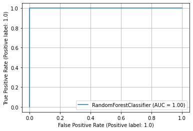
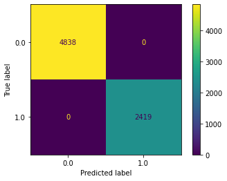

<font size="5">End To End Machine Learning pipeline with Feature selection and Hyperparameter tuning</font>


    
<font size="3">Instructions:</font>    


Pipeline takes following parameters:


1)<b>label_name</b>:str Complusory
 

<strong>------------------------------------------------------------------------------------------------</strong>
 
2)<b>algo</b>:str

Algorithm to use to train models.(Current available options 1.Random Forest;2.Logistic Regression)


<strong>-----------------------------------------------------------------------------------------------------</strong>


3)<b>scoring</b> :str 
  
metric to maximize


<strong>----------------------------------------------------------------------------------------------------</strong>


4)<b>categorical_cols</b>:List(str) default:[]
  
List of Columns to convert to Ordinal values


<strong>-----------------------------------------------------------------------------------------------------</strong>


5)<b>want_preprocess</b>:bool default:True
 
Whether to avail preprocessing provided by the pipeline


<strong>----------------------------------------------------------------------------------------------------</strong>


6)<b>first iter</b>:bool default:False

Train base models

<strong><font size="2">Note</font>:Only set true while running code for first time or using a previously unused 
    
algorithm(set by algo parameter) and scoring for the first time.</strong>
<break>
<break>
<break>

<strong>---------------------------------------------------------------------------------------------------------</strong>    
    
7)<b>want_train</b>:bool default:False

train models on transformed dataset

<strong><font size="2">Note</font>:Setting this to true will trains models and stores them in your current directory</strong>

Can access the estimator trained on best features through the varialbe self.best_estimator

    
    
<strong>---------------------------------------------------------------------------------------------------------</strong>


8)<b>recheck</b>:bool default:False
<p>
recompute best features

<strong><font size="2">Note</font>:Setting this to true will trains models and stores them in your current directory</strong>
</p> 
    


```python
import import_ipynb
from Full_Pipeline import Pipeline
import matplotlib.pyplot as plt
%matplotlib inline
```


```python
ordi_cols=['gender','ever_married','Residence_type', 'smoking_status']
selector=Pipeline('stroke',algo='Random_Forest',scoring='roc_auc',categorical_cols=ordi_cols)
trainingdata,traininglabel=selector.fit_transform('stroke2.csv')
# print(boardgamestrain)
```

    F:\Anaconda\envs\tensor 2\lib\site-packages\pandas\core\frame.py:4174: SettingWithCopyWarning: 
    A value is trying to be set on a copy of a slice from a DataFrame
    
    See the caveats in the documentation: https://pandas.pydata.org/pandas-docs/stable/user_guide/indexing.html#returning-a-view-versus-a-copy
      errors=errors,
    


```python
selector.predict_and_plot('plot_roc_curve',trainingdata,traininglabel,selector.best_estimator)
plt.show()
```


    

    


```python
selector.predict_and_plot('predictions',trainingdata,traininglabel,selector.best_estimator)
```


    array([1., 0., 0., ..., 1., 1., 0.])


```python
selector.predict_and_plot('accuracy_score',trainingdata,traininglabel,selector.best_estimator)
```


    1.0


```python
selector.predict_and_plot('precision_score',trainingdata,traininglabel,selector.best_estimator)
```


    1.0


```python
selector.predict_and_plot('recall_score',trainingdata,traininglabel,selector.best_estimator)
```


    1.0


```python
selector.predict_and_plot('roc_auc_score',trainingdata,traininglabel,selector.best_estimator)
```


    1.0


```python
selector.predict_and_plot('confusion_matrix',trainingdata,traininglabel,selector.best_estimator)
```


    

    

