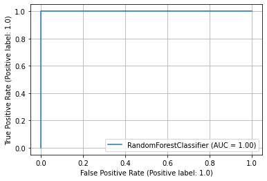
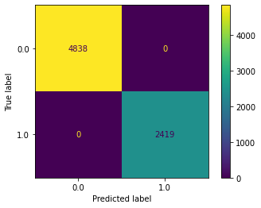

<strong><font size="5">End To End Machine Learning pipeline with Feature selection and Hyperparameter tuning</font></strong><br><br>


<strong><font size="3">Introduction</strong></font><br><br>

An end to end machine learning pipeline which takes path to a csv file as the input and returns a dataframe with best features.<br><br>
Along with feature selection the pipeline also provides features like:<br><br>
<font color='blue'>1)Preprocessing the entire dataset<br><br>
2)Balance the Dataset.<br><br>
3)Split into training data and testing data.<br><br>
4)Normalizing the Data.<br><br>
5)Dealing N/A values.<br><br>
6)Train models(Random Forest and logistic Regression) on the dataset with the best selected features.<br><br>
7)Various Data visualization tasks</font><br><br><br><br>
    
<strong><font size="3">Instructions:</font><br><br><br><br></strong>


Pipeline takes following parameters:<br><br><br>


1)<b>label_name</b>:str Complusory
 

<strong>------------------------------------------------------------------------------------------------</strong><br><br><br>
 
2)<b>algo</b>:str

Algorithm to use to train models.(Current available options 1.Random Forest;2.Logistic Regression)


<strong>-----------------------------------------------------------------------------------------------------</strong><br><br><br>


3)<b>scoring</b> :str 
  
metric to maximize


<strong>----------------------------------------------------------------------------------------------------</strong><br><br><br>


4)<b>categorical_cols</b>:List(str) default:[]
  
List of Columns to convert to Ordinal values


<strong>-----------------------------------------------------------------------------------------------------</strong><br><br><br>


5)<b>want_preprocess</b>:bool default:True
 
Whether to avail preprocessing provided by the pipeline


<strong>----------------------------------------------------------------------------------------------------</strong><br><br><br>


6)<b>first iter</b>:bool default:False

Train base models

<strong><font size="2" color='red'>Note:Only set true while running code for first time or using a previously unused
    
algorithm(set by algo parameter) and scoring for the first time.</strong></font>
<break>
<break>
<break>

<strong>---------------------------------------------------------------------------------------------------------</strong><br><br><br>    
    
7)<b>want_train</b>:bool default:False

train models on transformed dataset

<strong><font size="2" color='red'>Note:Setting this to true will trains models and stores them in your current directory</strong></font>

Can access the estimator trained on best features through the varialbe self.best_estimator

    
    
<strong>---------------------------------------------------------------------------------------------------------</strong><br><br><br>


8)<b>recheck</b>:bool default:False
<p>
recompute best features

<strong><font size="2" color='red'>Note:Setting this to true will train models and stores them in your current directory</strong></font><br><br>
    
    
<font size="2" color='green'>For More Details on parameters refer to comments in the Full_Pipeline</font>


 
    

<font size='5'><strong>CODE</font></strong><br>


```python
import import_ipynb
from Full_Pipeline import Pipeline
import matplotlib.pyplot as plt
import warnings; warnings.simplefilter('ignore')
%matplotlib inline
```


```python
ordi_cols=['gender','ever_married','Residence_type', 'smoking_status']
selector=Pipeline('stroke',algo='Random_Forest',scoring='roc_auc',categorical_cols=ordi_cols)
trainingdata,traininglabel=selector.fit_transform('stroke2.csv')
# print(boardgamestrain)
```

<font size='5'><strong>Results</font></strong><br><br><br>

<font size='4'><strong>ROC_AUC_CURVE</font></strong><br>


```python
selector.predict_and_plot('plot_roc_curve',trainingdata,traininglabel,selector.best_estimator)
plt.show()
```


    

    


<font size='4'><strong>PREDICTIONS</font></strong><br>


```python
selector.predict_and_plot('predictions',trainingdata,traininglabel,selector.best_estimator)
```


    array([1., 0., 0., ..., 1., 1., 0.])


<font size='4'><strong>ACCURACY_SCORE</font></strong><br>


```python
selector.predict_and_plot('accuracy_score',trainingdata,traininglabel,selector.best_estimator)
```


    1.0


<font size='4'><strong>PRECISION_SCORE</font></strong><br>


```python
selector.predict_and_plot('precision_score',trainingdata,traininglabel,selector.best_estimator)
```


    1.0


<font size='4'><strong>RECALL_SCORE</font></strong><br>


```python
selector.predict_and_plot('recall_score',trainingdata,traininglabel,selector.best_estimator)
```


    1.0


<font size='4'><strong>ROC_AUC_SCORE</font></strong><br>


```python
selector.predict_and_plot('roc_auc_score',trainingdata,traininglabel,selector.best_estimator)
```


    1.0


<font size='4'><strong>CONFUSION MATRIX</font></strong><br>


```python
selector.predict_and_plot('confusion_matrix',trainingdata,traininglabel,selector.best_estimator)
```


    

    

